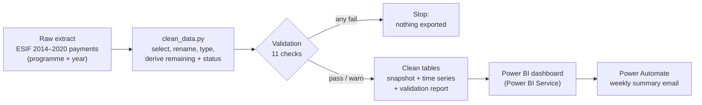

# EU Fund Governance Tracker

A small end-to-end reporting pipeline that monitors how far EU structural fund programmes (ESIF 2014–2020) have paid out their planned budgets: **Python (pandas)** for cleaning and validation, **Power BI** for the dashboard and **Power Automate** for a weekly summary email.

**Questions it answers**

- How much of the planned EU budget has been paid, by country and programme?
- Which programmes are behind on payments and need attention?
- How has the overall payment rate developed from 2014 to 2024?

---

## Results: 2023 snapshot

| Measure | Value |
|---|---|
| Programmes | 100 (22 countries plus Interreg cross-border programmes) |
| Planned EU amount | €62.3bn |
| Paid | €51.0bn |
| Remaining | €11.3bn |
| Payment rate (paid ÷ planned) | 81.9% |
| Programmes by status | 60 high, 25 medium, 14 low progress, 1 unknown |
| Largest remaining amounts | Italy €3.6bn, Poland €2.5bn, Spain €1.7bn |

Payment status is a traffic-light rule: **high** ≥ 85% paid, **medium** 50–84%, **low** < 50%.

---

## Pipeline



`scripts/clean_data.py` produces three files in `data/clean/`:

| File | Grain | Used for |
|---|---|---|
| `esif_snapshot_2023.csv` | one row per programme / fund / region category, 2023 | KPI tiles, country chart, status chart |
| `esif_timeseries.csv` | one row per year, 2014–2024 | payment-rate trend |
| `validation_report.csv` | one row per check | audit trail of each run |

2025–2026 are excluded from the time series because their coverage is incomplete and would push the rate upwards.

---

## Validation

Every run checks the data at two stages and records the results. A **fail** stops the script before anything is exported; a **warn** is reported but does not stop it.

| Stage | Check | Rule | Severity |
|---|---|---|---|
| Raw | Required columns present | 0 missing | fail |
| Raw | Duplicate programme / fund / region / year rows | 0 | fail |
| Raw | Row count not capped | ≠ 1,000 (possible export limit) | warn |
| Snapshot | Programme rows unique | 0 duplicates | fail |
| Snapshot | No missing key fields (country, programme, amounts) | 0 missing | fail |
| Snapshot | No negative amounts | 0 | fail |
| Snapshot | Payment rate in range | 0–105% | fail |
| Snapshot | Payments within planned amount | ≤ 105% of planned | fail |
| Snapshot | Snapshot total reconciles to raw data | difference < €1 | fail |
| Snapshot | Payment rate available | 0 missing | warn |
| Snapshot | Reported rate matches payments ÷ planned | within 0.5 pp | warn |

### What the checks found

- **The raw file has exactly 1,000 rows,** which suggests the export hit a row limit. All figures above therefore describe this extract, not the full ESIF dataset.
- **3 of 99 programmes report a payment rate 2.4–4.8 pp below payments ÷ planned** (e.g. 2014IT05SFOP011: 86.1% reported vs 91.0% recalculated). The source likely uses a different payment definition for these; they are flagged rather than overwritten.
- **1 programme has a planned amount of zero,** so no payment rate can be calculated; it appears as "Unknown" status.
- The snapshot's planned total reconciles exactly with the raw 2023 data, and there are no duplicates, negative amounts or missing key fields.

---

## Dashboard

Four panels in Power BI, published to Power BI Service: KPI tiles, programme payment status, the payment-rate trend 2014–2024 and planned vs paid by country.


## Automation

A scheduled Power Automate flow ("Weekly Fund Governance Summary": Recurrence → Send an email) sends a weekly summary email.


---

## Repository structure

```
data/esif_2014_2020_payments.csv   raw extract
data/clean/                         cleaned tables and validation report
scripts/clean_data.py               cleaning, validation and export
docs/                               dashboard and automation screenshots
```

## How to run

```bash
pip install pandas
python scripts/clean_data.py
```

The script prints a data quality summary and the validation table, then writes the files to `data/clean/`.

## Limitations

- The figures cover a 1,000-row extract (100 programmes in the 2023 snapshot), not every ESIF 2014–2020 programme.
- Payment-status thresholds (85% / 50%) are an analytical choice, not an official classification.
- Interreg cross-border programmes are reported as their own group rather than under a single country.

## Data source

European Commission, [Cohesion Open Data Platform](https://cohesiondata.ec.europa.eu/), ESIF 2014–2020 EU payments by programme. Reused with attribution under the Commission's open data reuse policy.
