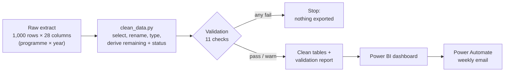
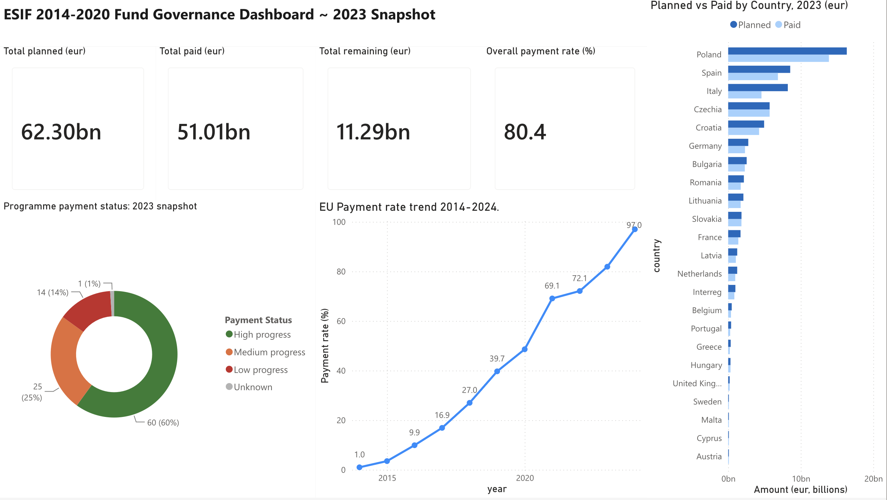
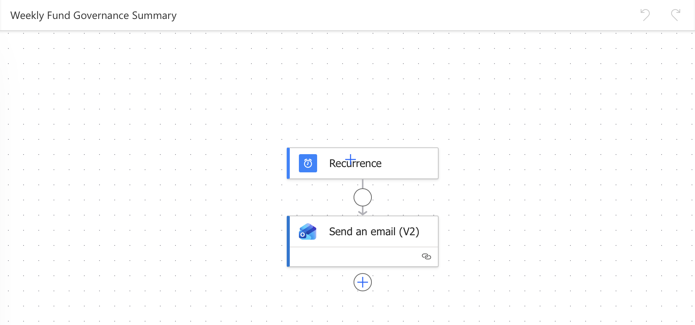

# EU Fund Governance Tracker

An end-to-end data pipeline and governance dashboard built on real EU structural fund data: automated data cleaning with validation, interactive visualisation and scheduled reporting, modelled on the mandate-management workflows used by fund institutions.

---

## Project Overview

The European Structural and Investment Funds (ESIF) finance programmes across EU member states over the 2014–2020 programming period. Tracking payment progress, identifying absorption risk and delivering regular governance summaries are core activities for any mandate management team.

This project builds a lightweight version of that infrastructure from scratch:

- A **Python pipeline** that ingests raw EU payment data, validates it at each stage and exports analysis-ready tables
- A **Power BI dashboard** that visualises fund performance across countries, fund types and time
- A **Power Automate flow** that sends a scheduled weekly governance summary email every Monday

All components use real, publicly available EU Open Data and the Microsoft 365 stack.

### Results: 2023 snapshot

| Measure | Value |
|---|---|
| Programmes | 100 (22 countries plus Interreg cross-border programmes) |
| Planned EU amount | €62.30bn |
| Paid | €51.01bn |
| Remaining | €11.29bn |
| Payment rate (paid ÷ planned) | 81.9% |
| Programmes by status | 60 high, 25 medium, 14 low progress, 1 unknown |

---

## Repository Structure

```
eu-fund-governance-tracker/
│
├── data/
│   ├── esif_2014_2020_payments.csv        # Raw extract (EU Open Data)
│   └── clean/
│       ├── esif_snapshot_2023.csv         # Main analysis table (2023 snapshot)
│       ├── esif_timeseries.csv            # Aggregated time series 2014–2024
│       └── validation_report.csv          # Result of every validation check, per run
│
├── scripts/
│   └── clean_data.py                      # Cleaning, validation and export
│
├── docs/
│   ├── dashboard.png                      # Power BI dashboard
│   └── power_automate.png                 # Power Automate flow
│
└── README.md
```

---

## Data Source

**ESIF 2014–2020 EU Payments (daily update)**
Published by the European Commission, Directorate-General for Regional and Urban Policy, on the [Cohesion Open Data Platform](https://cohesiondata.ec.europa.eu/) / [data.europa.eu](https://data.europa.eu). Reused with attribution under the Commission's open data reuse policy.

The dataset tracks cumulative EU payments to ESI Fund programmes, including ERDF, ESF, Cohesion Fund, EAFRD, EMFF, YEI and FEAD.

---

## Component 1: Python Data Pipeline



### What it does

`scripts/clean_data.py` takes the raw 1,000-row, 28-column ESIF payments extract, validates it, and produces two analysis-ready tables plus a validation report.

### Key design decisions

**Snapshot year selection:** The dataset is cumulative: each row represents total payments from 2014 up to that year, not payments made in that year alone. Keeping all years and summing would multiply every amount by up to 13×, so a single snapshot year is used for cross-sectional analysis.

The `is_latest_period` flag in the raw data marks only 33 rows, all from 2026, covering just 11 countries: an incomplete snapshot that would produce a misleading dashboard. **2023 was selected as the main snapshot year** because it is the last year with full coverage in the extract: 100 programmes, 22 countries plus Interreg, all major fund types represented.

**Fund type simplification:** Three verbose YEI variants (`YEI`, `YEI ESF Matching Component`, `YEI Specific Allocation`) are collapsed into a single `YEI` label to avoid artificial fragmentation in visualisations.

**Terminology choice:** The derived column for unpaid allocation is named `remaining_eur` rather than `unspent_eur`. In EU fund governance, money not yet paid out is not necessarily a problem: it may be scheduled, pending verification or within programme timelines. "Remaining" is neutral and accurate; "unspent" implies a negative judgement.

**Payment status thresholds:** Programmes are categorised into three bands:
- **High progress:** payment rate ≥ 85%
- **Medium progress:** payment rate 50–84%
- **Low progress:** payment rate < 50%

Thresholds reflect realistic expectations for a programme running since 2014 and approaching closure. They are an analytical choice, not an official classification.

**Time series scope:** 2025 and 2026 are excluded from the trend because coverage is incomplete (34 and 33 rows vs. 100 for full years). Including them would suggest accelerated late-period spending that isn't real.

### Validation

Every run checks the data at two stages and writes the results to `data/clean/validation_report.csv`. A **fail** stops the script before anything is exported; a **warn** is reported but does not stop it.

| Stage | Check | Rule | Severity |
|---|---|---|---|
| Raw | Required columns present | 0 missing | fail |
| Raw | Duplicate programme / fund / region / year rows | 0 | fail |
| Raw | Row count not capped | ≠ 1,000 (possible export limit) | warn |
| Snapshot | Programme rows unique | 0 duplicates | fail |
| Snapshot | No missing key fields (country, programme, amounts) | 0 missing | fail |
| Snapshot | No negative amounts | 0 | fail |
| Snapshot | Payment rate in range | 0–105% | fail |
| Snapshot | Payments within planned amount | ≤ 105% of planned | fail |
| Snapshot | Snapshot total reconciles to raw data | difference < €1 | fail |
| Snapshot | Payment rate available | 0 missing | warn |
| Snapshot | Reported rate matches payments ÷ planned | within 0.5 pp | warn |

**What the checks found:**

- **The raw file has exactly 1,000 rows,** which suggests the export hit a row limit. All figures describe this extract, not every ESIF programme.
- **3 of 99 programmes report a payment rate 2.4–4.8 pp below payments ÷ planned** (e.g. 2014IT05SFOP011: 86.1% reported vs 91.0% recalculated). The source likely uses a different payment definition for these; they are flagged, not overwritten.
- **1 programme has no payment rate** (planned amount of zero); it appears as "Unknown" in the status breakdown.
- **Accepted gaps:** `programme_title` is missing for 3 rows (`programme_code` still identifies them) and `region_category` for 36 rows (programmes operating at national rather than regional level).
- The snapshot's planned total reconciles exactly with the raw 2023 data, with no duplicates, negative amounts or missing key fields.

### Outputs

| File | Rows | Columns | Purpose |
|------|------|---------|---------|
| `esif_snapshot_2023.csv` | 100 | 14 | Cross-sectional analysis; all dashboard visuals except the trend line |
| `esif_timeseries.csv` | 11 | 4 | Annual trend line (2014–2024) |
| `validation_report.csv` | 11 | 5 | Audit trail of each run's checks |

### Running the pipeline

```bash
pip install pandas
python scripts/clean_data.py
```

The script prints a data quality summary and the validation table, then writes the files to `data/clean/`.

---

## Component 2: Power BI Dashboard

### What it shows

A single-page governance dashboard with four visuals built on the two clean tables, published to Power BI Service.

**KPI cards (top row):** Total Planned (€62.30bn), Total Paid (€51.01bn), Total Remaining (€11.29bn) and Overall Payment Rate.

**Programme payment status, 2023 snapshot (donut chart):** Traffic-light breakdown of all 100 programmes: 60% high, 25% medium, 14% low progress, 1% unknown.

**Planned vs paid by country, 2023 (clustered bar chart):** Countries ranked by planned allocation. Poland leads at €16.3bn planned. Italy shows the largest gap between planned and paid (€3.6bn remaining) despite being the third-largest recipient: a governance risk signal.

**EU payment rate trend 2014–2024 (line chart):** From a 1% payment rate in 2014 to 97% by 2024. The steep acceleration from 2019 reflects programme maturity and approaching closure deadlines.



### Data model

Two tables loaded separately in Power BI Desktop:
- `esif_snapshot_2023` powers all cross-sectional visuals
- `esif_timeseries` powers the trend line only

The tables are intentionally not related, because they have different granularities (programme-level vs. year-level aggregate). Each visual queries only the table that matches its purpose.

---

## Component 3: Power Automate Flow

### What it does

A scheduled cloud flow that runs every Monday and delivers a governance summary email, simulating automated mandate status reporting.

**Trigger:** Recurrence, every Monday
**Action:** Send an email (Office 365 Outlook) with key metrics, the programme status breakdown and the top countries by planned and remaining allocation. A dynamic `utcNow()` timestamp at the top dates each email automatically.

```
[Recurrence trigger: every Monday]
            ↓
[Send email: Office 365 Outlook]
  Subject: Weekly Fund Governance Summary – ESIF 2014-2020
  Body:    Structured summary with dynamic timestamp + key metrics
```

In production, the flow would read the metrics from a live data source such as a SharePoint list or database. In this prototype, they come from the 2023 snapshot analysis; the point is the automation pattern: a summary delivered on schedule without manual work.



---

## Key Findings

1. **Overall payment rate of 81.9%** (paid ÷ planned) as of 2023: broadly on track, given that some programmes run to their 2025/2026 closure dates.
2. **Italy presents the largest absorption risk:** third-largest recipient at €8.2bn planned, with €3.6bn (44%) still remaining in 2023, the highest remaining amount of any country.
3. **14 programmes (14%) are in low progress,** below a 50% payment rate: priority cases for a mandate management team.
4. **Payments accelerated sharply from 2019:** the payment rate rose from 40% in 2019 to 82% in 2023, reflecting programme maturity and closure deadlines.
5. **Poland is the largest recipient** at €16.3bn planned, nearly double Spain in second place.

---

## Technical Stack

| Component | Tool | Purpose |
|-----------|------|---------|
| Data cleaning and validation | Python, pandas | Pipeline, validation checks, export |
| Dashboard | Power BI Desktop / Service | Visualisation, data model, publishing |
| Automation | Power Automate (Office 365 Outlook) | Scheduled reporting flow |
| Version control | Git / GitHub | Code, history, documentation |
| Data source | EU Cohesion Open Data | ESIF 2014–2020 payments |

---

## Limitations

- Figures cover a 1,000-row extract (100 programmes in the 2023 snapshot), not every ESIF 2014–2020 programme.
- Interreg cross-border programmes are reported as their own group rather than under a single country.
- The weekly email uses metrics from the snapshot analysis rather than a live connection.

---

## Author

Ksenija Kankaras
BSc Economics, Management and Computer Science, Bocconi University
[ksenija.kankaras@studbocconi.it](mailto:ksenija.kankaras@studbocconi.it)
